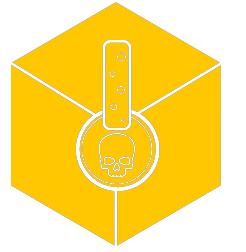

<div align="center">
  
  <h1>BotAnnotator</h1>
</div>

BotAnnotator is a component of AOPbot, a Text Mining tool for AOP (Adverse Outcome Pathway) development actively being developed under the project Partnership for the Assessment of Risks from Chemicals (PARC).


### Description 📝
BotAnnotator is specifically designed for biomedical concept extraction from text. It leverages natural language processing (NLP) techniques and machine learning models to identify and annotate relevant biomedical entities such as chemicals, diseases, genes, and other entities of interest within text documents.

## Installation 💻
Getting started with BotAnnotator is quick and easy. Simply follow the steps below to install AOPbot on your machine:
```shell
git clone https://github.com/Crispae/BotAnnotator.git
cd BotAnnotator
pip install -r requirements.txt
python setup.py install
```

### BotAnnotator component 🧬  

##### BERN2 🌱  

   Python 3.17.16 🐍
   - Download resources from google drive [link](https://drive.google.com/file/d/147b3OhU4IdQi121ZBUSqO1XKdKoXE5DK/view)
   - Fork BERN2 modified repository from this [repo](https://github.com/Crispae/Bern2Integration.git), changes has been made in this repo for easy integration with AOP-Bot.
   - Install the requirements in BERN2 enviornment as mentioned in official repo.
   - Run **bern_window** bat file to run the java based dependecies (downloaded resources from google drive).
   - In BERN2 directory in BERN2 environment run
     ```python
      python multi_ner\ner_server.py --mtner_home multi_ner
      ````
     This will start NER :whale:server along with all dependecy of BERN2. AOPBot will seamfully integrate with this using BioAnnotator  
---
  
##### REACH 🧪
 Reach can be installed using  :whale:. Follow the below steps to configure Reach
  ```shell
  docker run --tty --detach --name reach_webservices --publish <port>:8080 --restart unless-stopped pathwaycommons/reach-docker:latest
  ```
 Provide the same port number at <port> which you will use in BioAnnotator config
 Once done REACH server will start running on http://localhost:port  

 ---
  

##### Huner (LSTM CRF based) 🧠
  Huner is a Named Entity Recognition (NER) model that utilizes the Flair library for natural language processing. It is designed   to identify and extract named entities from biomedical text
  
  Implementation through :whale: container
  ```shell
  git clone https://github.com/Crispae/hunderDock.git
  cd hunderDock
  docker build --no-cache -t huner .
  docker run -p 4031:4031 huner  
  ```  

  ---
 ##### BERT 🤖🔠
 BioBERT is a specialized version of the BERT (Bidirectional Encoder Representations from Transformers) model that is specifically trained for biomedical and clinical text. It is designed to understand and process scientific and biomedical literature, making it particularly useful for tasks such as biomedical text mining, biomedical named entity recognition.  

 ---
  

##### ABNER 📚 
  ABNER is a widely used named entity recognition (NER) tool. AOPbot provides seamless integration with ABNER through a dedicated Python wrapper. For detailed installation instructions, please refer to the ABNER python wrapper [repository](https://github.com/Crispae/Abner_wrapper).
  
  Easy implementation through :whale: container
  
  ```shell
  git clone https://github.com/Crispae/Abner_wrapper.git
  cd Abner_wrapper
  docker build --no-cache -t abner-image .
  docker run -p 9000:9000 abner-image
  ```

  ---
  
#### BANNER 📖
  BANNER is a popular tool for biomedical named entity recognition. We have integrated BANNER into AOPbot to enhance its entity recognition capabilities.  

  ---

#### TEES 📖
  TEES is a powerful information extraction tool specifically designed for extracting events from scientific literature. It is actively integrated with AOPbot to extract relevant events for AOP development.  

  ---
  
#### SPARSER 📊
  SPARSER is an advanced semantic parser that enables the extraction of structured information from unstructured text. It plays a   vital role in transforming raw text into meaningful structured data for AOP analysis.  

  ---

### Contributing 🤝

Contributions to BotAnnotator are welcome! If you encounter any issues, have suggestions for improvements, or would like to contribute new features, please open an issue or submit a pull request on the GitHub repository.  

### License 📜
This project is licensed under the MIT License. See the LICENSE file for more information.  

### Contacts ✉️
For any inquiries or questions, please contact:

    Saurav Kumar
    Email: saurav.kumar@iispv.cat
  
